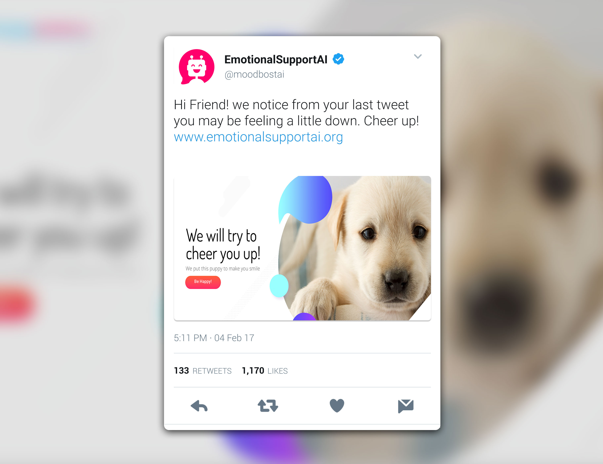
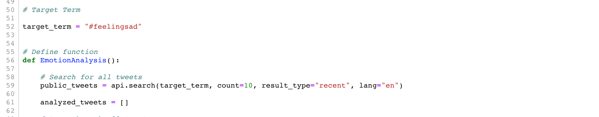
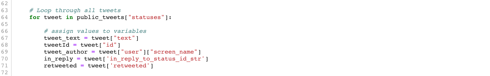
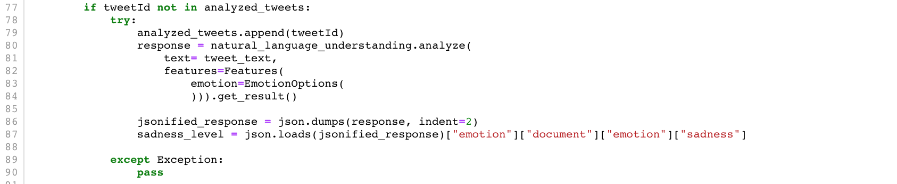
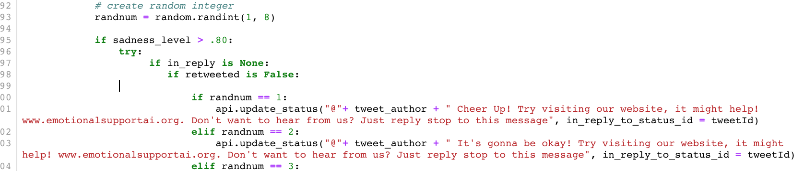

# EmotionalSupportAI


Our goal and inspiration for this project was to focus on how we can use technology and data to help others. Specifically to promote selfcare and wellness. The concept that we developed was to utilize IBM Watson Natural Language Understanding and Twitter's API. Analyzing statuses from twitter that were selected with a target term, using Watson to determine if a user is expressing higher levels of sadness. Then to use a twitter bot to reach out to the user and connect them with helpful resources. 

The twitter account (https://twitter.com/BackupEmotion/with_replies)

The website (http://www.emotionalsupportai.org/)




## Getting Started

For this code to work you need API keys from IBM Watson Natural Language Understanding (https://console.bluemix.net/apidocs/natural-language-understanding) and Twitter's Developer Platform (https://developer.twitter.com/en.html). Ultimately we deployed this app using Heroku, but it can be run on just your local server. 

### Requirements 

```
watson_developer_cloud==2.4.1
tweepy==3.6.0
requests==2.18.4
```

### How The Code Works 

We housed this code all within one function. First making a twitter API request using a target term (#feelingsad)



We then loop through the requested tweets. 



Using a conditional to make sure no duplicate analyses are happening, we compare the tweet ID to our analyzed tweets list. If the id is not in the list the tweet ID gets appended, then we move on the Watson analysis. 



If the Watson analysis find the "sadness" of the tweet's text to be high (greater than 0.8). We then post an api.update_status in reply to the original tweet, using a randomly selected response option.  



We did a couple things to ensure Twitter wouldn't flag us as a spambot. The first was making sure we had a variety of messages to tweet out with our bot. We also, had to make sure to give the users we replied to an opt-out method. We also added in conditionals to make sure the tweets we replied to were retweets or responses to other tweets. 

## Authors

* **Carlos Murguia** (https://github.com/CarlosMurguia)
* **Catherine West** (https://github.com/cpwest)
* **Connor Cute** (https://github.com/ConnorbCute)
* **Luke Morrissey** 

See also the list of [contributors](https://github.com/cpwest/EmotionalSupportAI/graphs/contributors) who participated in this project.
